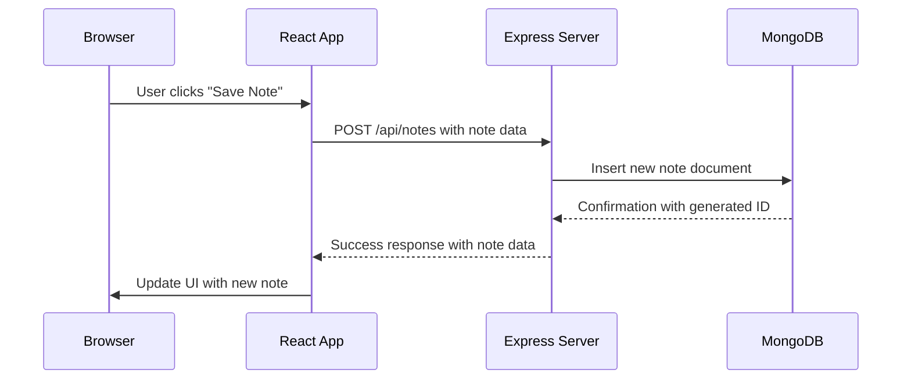
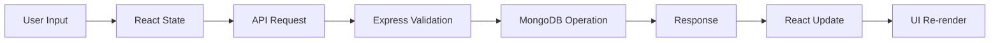
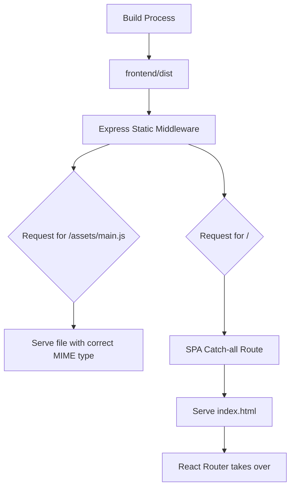

# ThinkerBoard - Complete Learning Guide

## Table of Contents
1. [Project Overview](#project-overview)
2. [Technology Stack Breakdown](#technology-stack-breakdown)
3. [Component Interactions](#component-interactions)
4. [Learning Path](#learning-path)
5. [Fundamental Concepts](#fundamental-concepts)
6. [Advanced Topics](#advanced-topics)
7. [Alternative Technologies](#alternative-technologies)
8. [Project Extensions](#project-extensions)

## Project Overview

ThinkerBoard is a full-stack note-taking application that demonstrates modern web development practices. It allows users to create, read, update, and delete notes with a clean, responsive interface.

### Key Features
- **CRUD Operations**: Create, Read, Update, Delete notes
- **Rate Limiting**: Protects API from abuse
- **Responsive Design**: Works on all device sizes
- **Real-time Updates**: Instant UI updates without page refresh
- **Modern UI**: Animated backgrounds and toast notifications

## Technology Stack Breakdown

### 1. MongoDB (Database)
**Role**: Stores and retrieves note data
**Why MongoDB**: 
- NoSQL database with flexible schema
- Perfect for applications with evolving data structures
- Scales horizontally with sharding
- Rich query capabilities for complex data

**How It Works in ThinkerBoard**:
```javascript
// backend/src/models/Note.js
const noteSchema = new mongoose.Schema({
    title: { type: String, required: true },
    content: { type: String, required: true },
}, { timestamps: true });
```

**Learning Path**:
1. **MongoDB Basics**: NoSQL concepts, document structure
2. **Mongoose ODM**: How JavaScript interacts with MongoDB
3. **Data Modeling**: Schema design for scalability
4. **Aggregation**: Advanced querying techniques

**Resources**:
- [MongoDB University](https://university.mongodb.com/)
- [Mongoose Documentation](https://mongoosejs.com/docs/)
- [NoSQL vs SQL](https://www.mongodb.com/nosql-vs-sql)

### 2. Express.js (Backend Framework)
**Role**: Handles HTTP requests and serves the application
**Why Express.js**:
- Minimalist framework with robust middleware system
- Large ecosystem of plugins and middleware
- Excellent performance for I/O operations
- Simple routing and API design patterns

**How It Works in ThinkerBoard**:
```javascript
// backend/src/server.js
const app = express();

// Middleware chain
app.use(cors());        // Handle cross-origin requests
app.use(express.json());   // Parse JSON bodies
app.use(rateLimiter);     // Protect from abuse

// Route handling
app.use('/api/notes', notesRoutes);

// Static file serving + SPA routing
app.use(express.static('../frontend/dist'));
app.get(/^((?!\/assets\/).)*$/, (req, res) => {
    res.sendFile('index.html');
});
```

**Learning Path**:
1. **Middleware Concept**: Request/response lifecycle
2. **Routing**: RESTful API design
3. **Static Serving**: How to serve frontend builds
4. **Error Handling**: Try/catch patterns
5. **Security**: CORS, rate limiting, validation

**Resources**:
- [Express.js Guide](https://expressjs.com/en/guide/routing.html)
- [REST API Design](https://restfulapi.net/)
- [Node.js Best Practices](https://github.com/goldbergyoni/nodebestpractices)

### 3. React (Frontend Library)
**Role**: Creates dynamic user interfaces
**Why React**:
- Component-based architecture for reusability
- Virtual DOM for efficient updates
- Large ecosystem and community support
- Hooks for state management and side effects
- Excellent for single-page applications

**How It Works in ThinkerBoard**:
```jsx
// frontend/src/App.jsx
const App = () => {
  return (
    <div className='relative h-full w-full'>
      <AnimatedBackground />
      <Routes>
        <Route path="/" element={<HomePage />} />
        <Route path="/create" element={<CreatePage />} />
        <Route path="/note/:id" element={<NoteDetailPage />} />
      </Routes>
    </div>
  );
};
```

**Learning Path**:
1. **Components**: Reusable UI building blocks
2. **State Management**: useState, useEffect hooks
3. **Routing**: Client-side navigation
4. **Props & Context**: Data flow patterns
5. **Hooks**: Custom hooks for complex logic

**Resources**:
- [React Documentation](https://react.dev/)
- [React Router](https://reactrouter.com/)
- [React Patterns](https://reactpatterns.com/)

### 4. Node.js (Runtime Environment)
**Role**: JavaScript execution environment outside browser
**Why Node.js**:
- Server-side JavaScript with npm ecosystem
- Non-blocking I/O for high performance
- V8 engine for optimized JavaScript execution
- Perfect for API servers and microservices

**How It Works in ThinkerBoard**:
```javascript
// backend/src/server.js
import express from 'express';
import dotenv from 'dotenv';

// ES6 modules with import/export
dotenv.config();

// Async/await patterns
connectDB().then(() => {
    app.listen(PORT, () => {
        console.log('Server started');
    });
});
```

**Learning Path**:
1. **Module System**: CommonJS vs ES Modules
2. **File System**: Path operations, streams
3. **Package Management**: npm, package.json
4. **Async Programming**: Promises, async/await
5. **Event Loop**: Understanding Node.js concurrency

**Resources**:
- [Node.js Documentation](https://nodejs.org/docs/)
- [npm Docs](https://docs.npmjs.com/)
- [Event Loop Guide](https://nodejs.org/en/docs/guides/event-loop-timers-and-nexttick.html)

## Component Interactions

### How Technologies Work Together

#### 1. Frontend to Backend Communication


#### 2. Data Flow Architecture


#### 3. Static Asset Serving


## Learning Path

### Phase 1: Foundations (Weeks 1-2)
**Goal**: Understand basic concepts and setup

**Topics**:
1. **JavaScript Fundamentals**
   - Variables, functions, objects, arrays
   - ES6+ features (arrow functions, destructuring)
   - Async programming basics

2. **Web Basics**
   - HTTP protocol fundamentals
   - Request/response cycle
   - REST API concepts
   - JSON data format

3. **Development Environment**
   - Terminal/command line basics
   - Git version control
   - VS Code or similar editor

**Practice Projects**:
- Simple to-do list (vanilla JS)
- Basic REST API (Node.js/Express)
- Static HTML/CSS page
- Git repository management

### Phase 2: Frontend Development (Weeks 3-5)
**Goal**: Build interactive user interfaces

**Topics**:
1. **React Fundamentals**
   - Components, props, state
   - JSX syntax and rules
   - Event handling
   - Conditional rendering

2. **Styling & UI**
   - CSS fundamentals
   - Tailwind CSS utility classes
   - Responsive design principles
   - Component composition

3. **State Management**
   - useState hook patterns
   - useEffect for side effects
   - Lifting state up
   - Context API for global state

**Practice Projects**:
- Interactive form with validation
- Component library (buttons, cards, modals)
- Personal portfolio site
- Weather dashboard with API integration

### Phase 3: Backend Development (Weeks 6-8)
**Goal**: Build robust APIs and data management

**Topics**:
1. **Express.js Deep Dive**
   - Middleware architecture
   - Route parameters and validation
   - Error handling patterns
   - Security best practices

2. **Database Integration**
   - MongoDB connection patterns
   - Mongoose schema design
   - CRUD operations
   - Data validation

3. **Authentication & Security**
   - JWT tokens
   - Password hashing
   - Rate limiting
   - CORS configuration

**Practice Projects**:
- Blog API with user authentication
- E-commerce backend with inventory
- Real-time chat with WebSockets
- File upload service with cloud storage

### Phase 4: Full-Stack Integration (Weeks 9-12)
**Goal**: Combine frontend and backend seamlessly

**Topics**:
1. **Deployment Strategies**
   - Build processes and optimization
   - Environment variables
   - Containerization (Docker)
   - CI/CD pipelines
   - Cloud platform deployment

2. **Performance Optimization**
   - Code splitting and lazy loading
   - Database indexing
   - Caching strategies
   - Monitoring and logging

3. **Advanced Patterns**
   - Microservices architecture
   - GraphQL vs REST
   - Server-side rendering
   - Progressive Web Apps

**Practice Projects**:
- Complete social media application
- Project management tool
- Analytics dashboard
- Multi-tenant SaaS application

## Fundamental Concepts

### 1. Separation of Concerns
**Frontend**: Handles UI/UX, user interactions, client-side routing
**Backend**: Manages data, business logic, API endpoints
**Database**: Persistent storage, data modeling, queries
**Benefits**: Easier maintenance, testing, scaling, team collaboration

### 2. Request-Response Cycle
1. **User Action** (click, type, navigate)
2. **React State Update** (immediate UI feedback)
3. **API Request** (HTTP request with data)
4. **Server Processing** (validation, database operation)
5. **Response Return** (success/error with data)
6. **UI Re-render** (update based on response)

### 3. Component-Based Architecture
**Atomic Design**: Small, focused components with single responsibilities
**Composition**: Combining components to build complex UIs
**Reusability**: Props and children for flexible usage
**State Isolation**: Each component manages its own state

### 4. RESTful API Design
**Resource Identification**: URLs represent data entities (/notes/:id)
**HTTP Methods**: GET (read), POST (create), PUT (update), DELETE (remove)
**Status Codes**: 200 (success), 201 (created), 404 (not found), 500 (error)
**Statelessness**: Each request contains all needed information

## Advanced Topics

### 1. Performance Optimization
**Frontend**:
- Code splitting with React.lazy()
- Memoization with useMemo(), useCallback()
- Virtual scrolling for large lists
- Image optimization and lazy loading

**Backend**:
- Database indexing for query performance
- Connection pooling for database efficiency
- Response caching with Redis
- Compression middleware for smaller payloads

### 2. Security Best Practices
**Frontend**:
- Input sanitization and validation
- XSS prevention with proper escaping
- CSRF protection with tokens
- Secure cookie handling

**Backend**:
- Rate limiting to prevent abuse
- Input validation and sanitization
- SQL injection prevention (even with NoSQL)
- Environment variable security
- HTTPS enforcement in production

### 3. Testing Strategies
**Unit Testing**:
- Jest for React components
- Mocha/Chai for Node.js functions
- Mocking external dependencies

**Integration Testing**:
- Supertest for API endpoints
- Cypress for end-to-end user flows
- Database testing with test containers

**Testing Pyramid**: 70% unit, 20% integration, 10% E2E

## Alternative Technologies

### Instead of React: Vue.js or Svelte
**Pros**: Smaller learning curve, better performance out-of-the-box
**Cons**: Smaller ecosystem, fewer job opportunities

### Instead of Express: Fastify or Koa
**Pros**: Better performance, more modern features
**Cons**: Less middleware, smaller community

### Instead of MongoDB: PostgreSQL or MySQL
**Pros**: ACID compliance, complex queries, mature tooling
**Cons**: Less flexible schema, horizontal scaling challenges

### Instead of Node.js: Deno or Bun
**Pros**: Better performance, TypeScript support, modern features
**Cons**: Smaller ecosystem, fewer libraries

## Project Extensions

### 1. Real-time Features
**Technologies**: WebSockets, Socket.io, WebRTC
**Implementation**: Live collaboration, notifications, real-time updates
**Learning Value**: Event-driven programming, real-time data sync

### 2. Authentication System
**Technologies**: JWT, Passport.js, OAuth, bcrypt
**Implementation**: User registration, login, protected routes
**Learning Value**: Security best practices, session management

### 3. File Upload/Storage
**Technologies**: Multer, AWS S3, Cloudinary
**Implementation**: Profile pictures, file attachments, document storage
**Learning Value**: File handling, cloud services, data management

### 4. Search & Filtering
**Technologies**: Elasticsearch, MongoDB text search, Algolia
**Implementation**: Full-text search, faceted filtering, sorting
**Learning Value**: Search algorithms, data indexing, performance optimization

### 5. Analytics & Monitoring
**Technologies**: Google Analytics, Mixpanel, Sentry
**Implementation**: User tracking, error monitoring, performance metrics
**Learning Value**: Data analysis, user behavior insights, system health

## Benefits of This Tech Stack

### 1. JavaScript Everywhere
- Single language for frontend and backend
- Reduced context switching
- Code sharing between client and server
- Larger talent pool and community

### 2. Rapid Development
- Hot module replacement in development
- Rich npm ecosystem with solutions for most problems
- JSON for data exchange (no serialization needed)
- Fast iteration cycles with immediate feedback

### 3. Cost-Effective Scaling
- Open-source technologies (no licensing costs)
- Cloud provider flexibility (AWS, Google Cloud, Azure)
- Horizontal scaling with commodity hardware
- Pay-as-you-grow pricing models

### 4. Strong Community & Job Market
- Massive developer community and Stack Overflow answers
- High demand for MERN stack developers
- Extensive documentation and tutorials
- Transferable skills to other JavaScript frameworks

## Next Steps After ThinkerBoard

1. **Master Advanced React**: Redux, React Native, Next.js
2. **Explore Microservices**: Break monolith into focused services
3. **Learn TypeScript**: Add type safety to your applications
4. **Cloud Architecture**: AWS, Google Cloud, or Azure deployment
5. **DevOps & CI/CD**: Docker, Kubernetes, GitHub Actions
6. **Testing**: Advanced testing patterns and test-driven development
7. **Performance**: Deep optimization and monitoring strategies

Remember: The goal isn't just to complete projects, but to understand **why** each technology exists and **how** they solve specific problems. This deeper understanding makes you a more versatile and valuable developer.